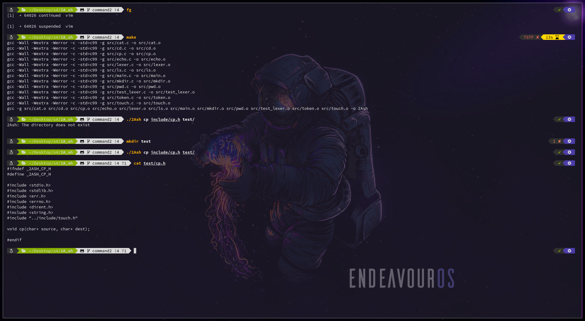

# ZSH

## What is ZSH ?

ZSH is a Unix shell that improve the Bourne shell with some features of Bash, ksh and tcsh.

## Why use ZSH instead of Bash ?

By default, ZSH is really similar to Bash but you can configure some options with a `.zshrc` file.

ZSH has more features, more customizability and many useful plugins that make life easier and increase your workflow.


## Install ZSH and its completion plugin

Look which shell you use

`which $SHELL`

Install zsh

`sudo pacman -S zsh`

Basic zsh completion

`sudo pacman -S zsh-completions`

Change your default shell to zsh

`chsh -s /usr/bin/zsh`

## Oh My Zsh

### What is Oh My Zsh ?

Oh My Zsh is an opensource framework for ZSH that help to manage and update plugins and themes.

### Install Oh My Zsh, some plugins and prompt theme

Install oh-my-zsh

```
sh -c "$(wget -O- https://raw.githubusercontent.com/ohmyzsh/ohmyzsh/master/tools/install.sh)"
```

Plugin - Syntax Highlighting

```
git clone https://github.com/zsh-users/zsh-syntax-highlighting.git ${ZSH_CUSTOM:-~/.oh-my-zsh/custom}/plugins/zsh-syntax-highlighting
```

Plugin - Autosuggestions

```
git clone https://github.com/zsh-users/zsh-autosuggestions.git ${ZSH_CUSTOM:-~/.oh-my-zsh/custom}/plugins/zsh-autosuggestions
```

Zsh Theme - Powerlevel10k

```
git clone https://github.com/romkatv/powerlevel10k.git ${ZSH_CUSTOM:-~/.oh-my-zsh/custom}/themes/powerlevel10k
```

## My Zsh config

### Screenshot



### Download

`git clone https://github.com/TCHEOUValentine/zshrc`

### Warning

Some colors might be different on your shell but you can easily change them in the `.p10k.zsh` file.
